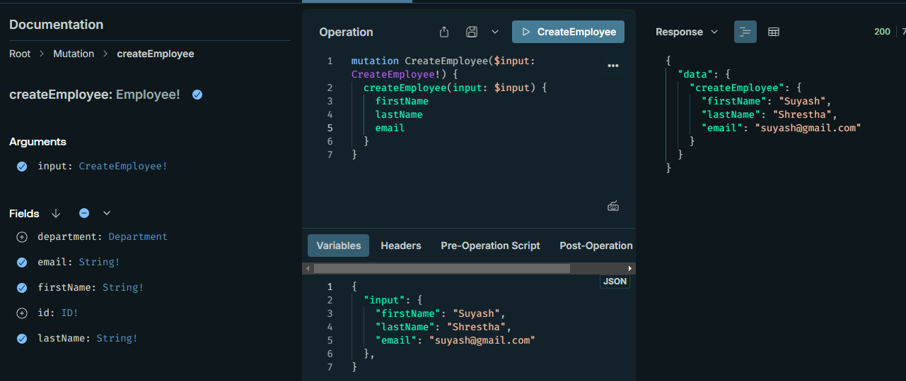

# Prisma ORM

Whenever you update your Prisma schema, you will have to update your database schema using either prisma migrate dev or prisma db push. This will keep your database schema in sync with your Prisma schema. The commands will also regenerate Prisma Client.

## Create Department

## Create Employee

## Assign Employee to Department

## Get All Departments

## Get Department by ID

## Get All Employees

## Get Employee by ID

